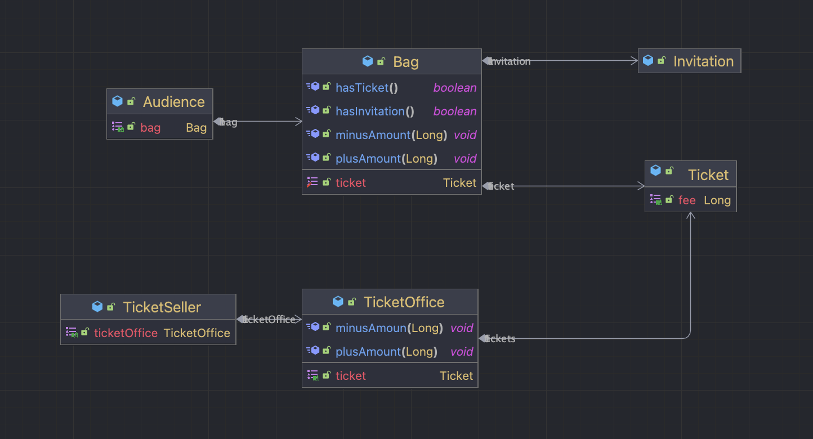
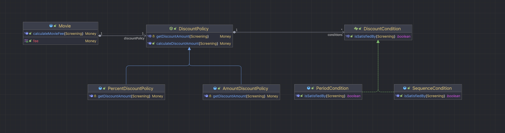
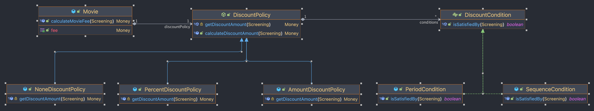

# Chap01 Step01



문제점

- `관람객과 판매원이 소극장의 통제를 받는다.`
  - 관람객
    - 소극장이 관람객의 가방을 마음대로 열어본다.
  - 판매원
    - 소극장이 매표소에 보관중인 티켓과 현금에 마음대로 접근한다.
- `이해 가능한 코드가 아니다.`
  - 동작이 예상을 크게 벗어난다.
  - 우리의 상식과 다르다.
    - 소극장이 직접 자동으로 관람객의 가방을 열어서 티켓을 꺼내 판매원에게 지불한다.
    - 소극장이 직접 자동으로 매표소에 있는 티켓을 꺼내 관람객에게 건내고 돈을 받아 보관한다.
  - 즉, 코드를 읽는 사람과 제대로 의사소통하기 어려운 코드다.
- `변경에 취약하다.`
  - 관람객이 현금과 초대장을 보관하기 위해 "항상 가방을 들고 다닌다."
    - 가방을 들고 있지 않은 관람객
    - 신용카드로 결제하는 관람객
    - 요구사항이 늘어날 시에 코드가 깨진다.
  - 의존성 문제
    - Theater가 지나치게 세부적인 사실에 의존한다.
    - Audience의 내부에 대해 많이 알고 있다.

<br>

# Chap01 Step02

- `문제 이해`
  - Theater가 관람객의 가방과 판매원의 매표소에 직접 접근한다.
    - Theater가 Audience와 TicketSeller에 결합된다는 것을 의미한다.
- `해결 방법`
  - 관람객이 가방을 가지고 있다는 사실
  - 판매원이 매표소에서 티켓을 판매한다는 사실
  - 두 사실을 Theater가 알지 못하도록 정보를 차단하면 된다.
  - `즉, 관람객과 판매원을 자율적인 존재로 만든다.`
    - `관람객`
      - 스스로 가방 안의 현금과 초대장을 처리한다.
    - `판매원`
      - 스스로 매표소의 티켓과 판매 요금을 다룬다.
- `TicketSeller 캡슐화`, `Audience 캡슐화`

<br>

- 설계를 어렵게 만드는 것
  - `의존성`
- 해결 방법
  - 불필요한 의존성을 제거하여 객체 사이의 결합도를 낮춘다.
  - Theater가 몰라도 되는 세부사항을 Audience와 TicketSeller 내부로 감춰 `캡슐화` 한다.
- `불필요한 세부사항 캡슐화`
  - 객체 내부로 캡슐화하는 것은 객체의 `자율성` 높인다.
- `훌륭한 객체지향 설계`
  - 자율적인 객체들이 낮은 결합도와 높은 응집도를 가지고 협력하도록 최소한의 의존성만을 남기는 것

<br>

# Chap01 Step03

- `의인화`
  - 현실에서는 수동적인 존재
  - `객체지향의 세계에 들어오면 모든 것이 능동적이고 자율적인 존재로 바뀐다.`

<br>

# Chap01 Step04

- 첫 번째 코드 (chap01-step01)
  - `데이터와 프로세스를 나누어 별도의 클래스에 배치`
- 두 번째 코드 (chap01-step01 -> chap01-step03)
  - `필요한 데이터를 보유한 클래스 안에 프로세스를 함께 배치`
- 진정한 객체지향 설계
  - `협력하는 객체들 사이의 의존성을 적절하게 조절`함으로써 변경에 용이한 설계를 만드는 것

<br>

# Chap02 Step01

- 클래스가 아닌 `객체에 초점을 맞춰라`
  - 어떤 클래스가 아닌 어떤 객체가 필요한지 고민해라
  - 객체를 독립적인 존재가 아니라 기능을 구현하기 위해 협력하는 공동체의 일원으로 봐라
- 클래스 구현
  - `클래스 경계 구분 짓기`
    - public, private, ...
    - 클래스는 내부와 외부로 구분되어진다.
    - `경계의 명확성이 객체의 자율성을 보장한다.`
- 자율적인 객체
  - 객체 내부에 대한 접근 통제
    - 객체를 자율적인 존재로 만들기 위해서
- 캡슐화와 접근제어
  - `퍼블릭 인터페이스 (public interface)`
    - 외부에서 접근 가능한 부분
  - `구현 (implementation)`
    - 외부에서는 접근 불가능하고 오직 내부에서만 접근 가능한 부분
- `구현 은닉`
  - 필요한 부분만 공개하고 나머지는 숨긴다.
- `접근 제어 메커니즘`
  - 내부와 외부를 명확하게 경계 지을 수 있게 한다.
  - 내부 구현을 은닉할 수 있게 한다.

<br>

- 할인 정책과 할인 조건
  - `Movie 객체에 할인 정책을 판단하는 코드는 존재하지 않는다.`
  - discountPolicy에게 메시지를 전송할 뿐이다.
  - `Template Method Pattern` 을 이용한다.
- 할인 정책 구성
  - 영화에 대해 하나의 할인 정책만 설정할 수 있다.
  - 할인 조건의 경우 여러 개를 적용할 수 있다.
  - `Movie와 DiscountPolicy 생성자는 이 제약을 강제한다.`

```java
  public Movie(String title, Duration runningTime, Money fee, DiscountPolicy discountPolicy) {
      ...
      this.discountPolicy = discountPolicy;
  }
```

- DiscountPolicy는 여러 개의 DiscountCondition 인스턴스를 허용한다.
```java
public abstract class DiscountPolicy {
  public DiscountPolicy(DiscountCondition... conditions) {
    this.conditions = Arrays.asList(conditions);
  }
}
```




<br>

- `상속과 다형성`
  - `컴파일 시간 의존성과 실행 시간 의존성`
    - `컴파일 시간 의존성 (초기 바인딩, 정적 바인딩)`
      - 컴파일 시점에 실행될 함수나 프로시저를 결정하는 것
      - 컴파일 시간 의존성 : Movie에서 DiscountPolicy로 향한다. 
    - `실행 시간 의존성 (지연 바인딩, 동적 바인딩)`
      - 실행 시간 의존성 : Movie에서 AmountDiscountPolicy나 PercentDiscountPolicy로 향한다.
- `구현 상속과 인터페이스 상속`
  - `구현 상속 (서브클래싱 subclassing)`
    - 순수하게 코드를 재사용하기 위한 목적으로 상속 
  - `인터페이스 상속 (서브타이핑 subtyping)`
    - 다형적인 협력 부모 클래스와 자식 클래스가 인터페이스를 공유할 수 있도록 상속을 이용하는 것
- DiscountPolicy - 추상 클래스
  - 구현을 공유할 필요가 있었다.
- DiscountCondition - 인터페이스
  - 구현을 공유할 필요가 없었다.

<br>

# Chap02 Step02

- 추상화
  - `추상화를 이용한 상위 정책 기술`
    - 기본적인 애플리케이션의 협력 흐름을 기술한다는 것을 의미
    - 재사용 가능한 설계의 기본
      - 디자인 패턴
      - 프레임워크
    - `기존 구조를 수정하지 않고도 새로운 기능을 쉽게 추가하고 확장할 수 있다.` 
- 할인 정책이 없는 영화를 계산하기 위한 기능 추가



