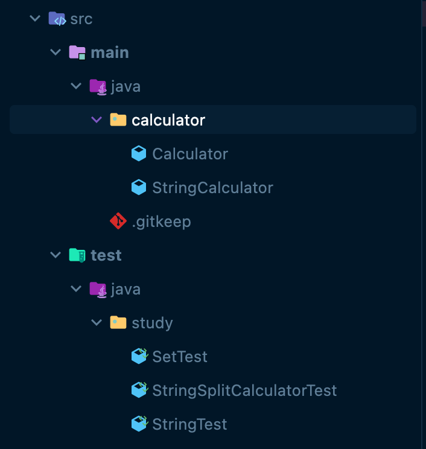

# 1주차 : 문자열 계산기
#넥스트스텝/자바플레이그라운드/문자열계산기

아래 링크는 미션을 수행한 실제 코드가 모여 있는 레포입니다.

[GitHub - hyena0608/java-baseball-playground at hyunseo](https://github.com/hyena0608/java-baseball-playground/tree/hyunseo)

<br>
<br>

첫 미션으로 문자열 계산기를 구현해보았다.
간단한 사칙연산 계산기 구현은 어렵지 않고 문자열 계산기를 구현하는 부분도 어렵지 않다.
하지만 이번 미션에서 배워가야 할 것은 따로 있다.

바로 

1. 메서드 분리
2. 함수명, 변수명 생각
3. 깃 커밋 메시지
4. 단위 테스트

가 있다.

계산기를 구현하고 끝내지말고
현재 내 코드가 재사용성이나 가독성이 좋은지 즉, 클린한 코드인지를 확인해가고 다른 사람들의 구현 방식을 보며 셀프 피드백하고 고쳐나가자.

<br>
<br>
<br>


# [1차 구현] - 문자열 계산기
처음 구현 했을 때의 모양이다.


StringSplitCalculatorTest를 구현했는데
StringCalculator와 단위 테스트를 위한 StringCalculatorTest로 나누어져 구현 되어있다.

- StringCalculator는 3개의 메서드로 구분 되었다.
	1. `calculateAll(String value)` : 밑의 두 메서드를 합쳐 문자열 계산기 기능을 한다.
	2. `calculateOnce(double sum, double x, String cal)`  : 하나의 계산을 하여 실수를 반환한다.
	3. `splitStringToStringArray(String value)` : 공백을 기준으로 분리하여 String 배열을 반환한다.

```java
package study;

import org.junit.jupiter.api.DisplayName;
import org.junit.jupiter.api.Test;

import static org.assertj.core.api.Assertions.*;

public class StringSplitCalculatorTest {

    StringCalculator stringCalculator = new StringCalculator();

    @Test
    @DisplayName("문자열 입력 계산")
    void stringsplitCalculator() {
        //given
        String value = "2 + 3 * 4 / 2";

        //when
        double sum = stringCalculator.calculateAll(value);

        //then
        assertThat(sum).isEqualTo(10);
    }

    @Test
    @DisplayName("공백 혹은 Null 에러")
    void expressionforEmptyOrNull() {
        String value = "2 * 3 4 / 2";
        assertThatThrownBy(() -> {
            stringCalculator.calculateAll(value);
        }).isInstanceOf(NumberFormatException.class);
    }
}

class StringCalculator {

    public double calculateAll(String value) {
        String[] values = splitStringToStringArray(value);
        double sum = Double.parseDouble(values[0]);
        for (int i = 1; i < values.length; i += 2) {
            sum = calculateOnce(sum, Double.parseDouble(values[i + 1]), values[i]);
        }
        return sum;
    }

    private double calculateOnce(double sum, double x, String cal) {
        switch(cal) {
            case "+":
                return sum + x;
            case "-":
                return sum - x;
            case "*":
                return sum * x;
            case "/":
                return sum / x;
            default:
                return 0.0;
        }
    }

    private String[] splitStringToStringArray(String value) {
        return value.split(" ");
    }
}
```

<br>
<br>
<br>

# [1차 셀프 피드백] - 문자열 계산기 구현
**셀프 피드백 내용**
1. [패키지] : Test에는 테스트 코드만 구현하라
2. [클래스 분리] : StringCalculator 한 클래스에 구현하지 말아라
3. [클래스 분리] : StringCalculator는 **유틸리티인지 객체인지** 확실하게,  
calculateOnce에서 연산 타입이 확실하지 않고 문자로만 되어 있는데 **인스턴스 변수로 선언**하라.
4. [테스트 코드] : 예외적인 입력값을 더 고민해서 추가해보아라.

<br>
<br>
<br>

## 1. 패키지
Test 클래스에 Test클래스가 아닌 다른 클래스도 존재한다.
이를 main으로 분리하여 상황에 맞는 디렉터리로 들어간다.

나는 StringSplitCalculatorTest 내에 테스트 이외의 코드를 src/main/java/calculator 디렉터리에
`Calculator.java`와 `StringCalculator.java` 로 두 클래스로 나누었다.



<br>
<br>
<br>

## 2. 클래스 분리 (1)
간단하게 사칙연산 계산기를 만드는 거라고 생각해서 클래스를 분리할 생각을 하지 못했다.
분리를 한다면 어떤 식으로 분리 해야할 지 감이 잡히지 않는데 평소에 클래스를 분리한다고 하면 의미를 기준으로 나누었기 때문이다.

이를 해결하기 위해서 아래와 같은 책, 블로그 포스팅을 읽었다.

- [책정보, 객체지향의 사실과 오해 : 네이버 책](https://book.naver.com/bookdb/book_detail.nhn?bid=9145968)
- [객체지향 프로그래밍으로 유틸리티 클래스를 대체하자. | Mimul Tech log](https://www.mimul.com/blog/oop-alternative-to-utility-classes/) 

<br>
<br>
<br>

## 3. 클래스 분리 (2)
내가 만드는 Calculator는 절차적 프로그래밍이 아닌 즉, 유틸리티 클래스가 아니라 객체로 만들 것이다.

먼저 Calculator.java를 보면
```java
package calculator;

public class Calculator {

    public static double caculateOnce(double num1, double num2, String operator) {
        switch(operator) {
            case "+":
                return num1 + num2;
            case "-":
                return num1 - num2;
            case "*":
                return num1 * num2;
            case "/":
                return num1 / num2;
            default:
                return 0.0;
        }
    }
}
```

> 위와 같이 switch문으로 사칙연산이 구분되어 지는데  
> switch문을 사용하지 않고 다른 더 객체지향적인 방법을 사용하라.   
> 즉, operator를 객체화 시켜보자.  

위에서 클래스를 두 개로 분리한 것으로 끝난 것이 아니다. 
좀 더 자세히 들여다 보면 더 클래스로 분리시켜 객체지향적으로 구현할 수 있는 부분들을 객체화 시키라는 말이다.


