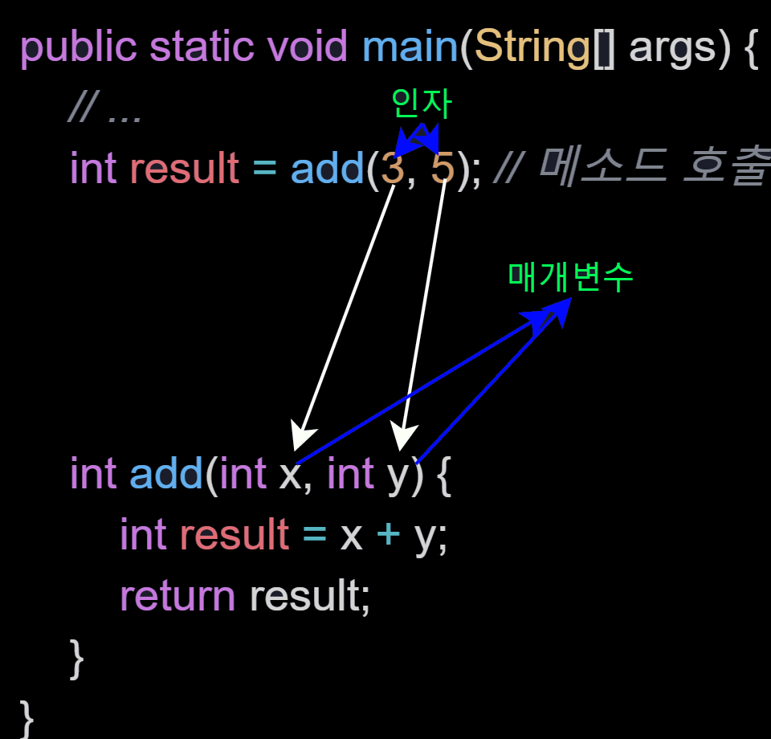

# 객체지향 🚀

객체지향이론의 기본 개념은 **발생하는 모든 사건들은 사물간의 상호작용**이라는 것이다.

객체지향은 **상속, 캡슐화, 추상화** 개념을 중심으로 발전되었다.

더 많은 개념들이 존재하지만 일단은 객체지향적인 설계를 하기 위한이 아닌

***객체지향이 무엇인지 어떻게 사용하는 건지 기초적인 것 부터 알아보자***

<br><br><br>

먼저 앞에서 [[자바] 배열](./[자바]_배열)에서 객체지향 개념이 나오기 전 데이터와 기능이 따로따로 존재했다는 것을 배웠었다.

객체 지향 개념이 나오면서 데이터와 그와 관련된 기능을 ***클래스***로 묶어서 사용할 수 있게 되었다고 했었다.

아래에서 클래스와 객체에 대해서 더 자세히 알아보자.

# 1. 클래스와 객체 🎈 (객체지향이론 관점)

<br>

클래스는 데이터와 그와 관련된 기능(메소드)을 가지고 있다.

그리고 클래스는 객체를 생성하는데 사용이 된다.

생성된 객체는 기능과 데이터(속성)을 가지고 있다.

주의해야 할 것은 객체는 가지고 있는 기능과 속성에 따라 다르는 것이다.

클래스는 결국 객체를 생성해주는 역할을 가지고 있다.

***객체지향이론 관점 : 클래스는 객체를 생성하기 위한 틀이고, 속성과 기능으로 정의되어 있다.***

클래스는 객체지향이론 관점이 아닌 프로그래밍 관점에서도 볼 수 있는데

프로그래밍에서의 객체는 클래스에 정의된 내용대로 메모리에 생성한다는 뜻을 가지고 있다.

밑에서 더 프로그래밍적인 관점에서 더 자세히 알아보자.

<br><br>

## 1-1. 클래스의 또 다른 정의 (프로그래밍 관점)

<br>

**1. 클래스 : 데이터와 함수의 결합**

프로그래밍 언어에서 데이터를 처리하기 위한 데이터 저장형태 (+ 발전 과정)

데이터 저장 형태는 4가지가 있다.

1. **변수** : 하나의 데이터를 저장할 수 있는 공간
2. **배열** : 같은 종유릐 여러 데이터를 하나의 집합으로 저장하는 공간
3. **구조체** : 서로 관련된 여러 데이터를 종류에 관계없이 하나의 집합으로 저장하는 공간
4. **클래스** : 데이터와 함수의 결합 (구조체 + 함수)

객체지향 개념이 있기 전에는 데이터와 함수를 따로 다루어져 왔지만, 함수는 주로 데이터와 항상 관계가 있기 때문에 관계가 깊었다.

그래서 객체지향개념이 나오면서 변수(데이터)와 함수를 하나의 클래스에 정의하여 함께 다룰 수 있게 됐다.

이 얘기도 [[자바]_배열](./[자바]_배열.md)에서 언급되었듯이

Java에서는 문자열을 char[]이 아닌 String클래스를 사용하는데 왜 클래스로 묶었을까에 대한 이유는 문자열을 다루는 함수를 클래스로 묶었기 때문이다.

<br>

재미있는 부분이 또 있다.

우리는 데이터 자료형 공부했을 때 기본형(primitive type)이 8개 인데 참조형(reference type)은 몇개인지 알려주지 않았다. 그 이유는 클래스는 사용자 정의 타입(user-defined type)이 있기 때문이다. 

<br>

클래스에 대해서 알아보았으니 이제 객체에 대해서 알아보자

<br><br>

## 1-2. 객체와 인스턴스

자바를 사용하다보면 객체, 인스턴스, 인스턴스화 같은 용어가 계속 나오는데 이 세 가지 용어의 차이를 말하기가 생각보다 쉽지 않을 수도 있다.

먼저 인스턴스화에 대해 알아보자면

클래스로 부터 객체를 만드는 과정을 `클래스의 인스턴스화`(instantiate)라고 한다.

클래스로부터 만들어진 객체를 그 `클래스의 인스턴스`(instance)라고 한다.

아니 그러면 객체나 인스턴스나 똑같은 말 아닌가 ??

정확하게 구분하자면

***객체***는 모든 인스턴스를 대표하는 포괄적인 의미를 갖고 있다.

***인스턴스***는 어떤 클래스로부터 만들었는지를 강조하는, 보다 구체적인 의미를 지닌다.

다음은 인스턴스를 어떻게 생성해서 사용하는지 예제와 그림을 통해 알아보자.

<br><br>

## 1-3. 인스턴스의 생성과 사용

```java
class Dog {
    // Dog의 속성(멤버변수)
    String name;
    boolean dangerous;
    int age;

    // Dog의 기능(메소드)
    void bark() {
        System.out.println(name); //강아지는 짖을 때 자신의 이름을 말한다.
    }
}

class DogTest {
    public static void main(String[] args) {
        Dog g;
        g = new Dog();
        g.name = "바둑이";
        g.age = 3;
        g.bark();
    }
}
```

인스턴스 생성과 인스턴스의 속성과 메소드가 어떤 식으로 변화되는지 알아보자.

위에 Dog클래스로부터 인스턴스를 생성하고 인스턴스의 속성과 메소드 사용 방법이다.

1. `Dog g;`
    - Dog 클래스 타입의 참조변수 g를 선언한다.
    - 이 때 메모리에 참조변수 g를 위한 공간이 만들어진다.
        - 참소변수 g는 앞으로 생성될 인스턴스의 주소가 들어간다.
    - 아직 참조변수를 선언한 것 뿐이라 인스턴스는 존재하지 않다.
    - 때문에 아직 아무것도 할 수 없다.

2. `g = new Dog();`
    - 연산자 new에 의해 Dog클래스의 인스턴스가 메모리의 빈 공간에 생성된다.
    - 멤버변수는 각 자료형의 기본값으로 자동 초기화된다.
    - 대입연산자 (=)에 의해서 생성된 객체의 주소값이 참조변수 g에 저장된다.
    - **인스턴스에 접근하기 위해서는 참조변수가 필요하다.**

3. `g.name = "바둑이";`
    - ***참조변수.멤버변수***
    - 참조변수 g에 저장된 주소에 있는 인스턴스의 멤버변수 name에 바둑이를 저장한다.

<br><br>

## 1-4. 객체 배열 

객체 배열이라고 들어본 적이 있는가?

사용한다고 해도 `List<Dog>` 이런 식으로 사용해왔지 실제로 `Dog[]`로 사용해본 기억이 없다.

당연히 객체도 배열로 다룰 수 있다.

물론 객체 배열 안에 객체가 저장되는 것이 아닌 객체의 주소가 저장된다.

간단하게 예제를 통해서 배우자 !

```java
class DogTest {
    public static void main(String[] args) {

        Dog[] dogArr = new Dog[3]; // 길이가 3인 Dog 객체 배별

        // Dog 객체를 생성해서 Dog 객체 배열의 각 요소에 저장한다.
        for (int i = 0; i < dogArr.length; i++) {
            dogArr[i] = new Dog();
            dogArr[i].name = "바둑이" + i;
        }

        for (int i = 0; i < dogArr.length; i++) {
            System.out.println(dogArr[i].name);
        }
    }
}

class Dog {
    String name;
    boolean dangerous;
    int age;

    void bark() {
        System.out.println(name);
    }
}
```

모든 배열과 같이 객체 배열도 같은 타입의 객체만 저장할 수 있다.

물론 하나의 배열로 여러 종류의 객체를 다룰 수 있는 방법이 존재한다.

[자바]_다형성에서 다루도록 하겠다.

<br><br><br>

# 2. 변수와 메서드 🎈

<br><br>

## 2-1. 선언위치에 따른 변수의 종류

***`클래스변수`, `인스턴스변수`, `지역변수`*** 이 세 종류를 들어보지 않았는가?

이 변수들은 '변수의 선언된 위치'에 따라 달라진다.

이 세 종류를 또 두 종류로 나눌 수 있는데

***멤버변수 : 클래스변수, 인스턴스변수***

***멤버변수를 제외한 변수 : 지역변수***

로 나뉘어 진다.

코드로 간단하게 어떻게 선언되어지는지 알아보자.

```java
{
    // 클래스 영역

    int instanceVaraible;       // 인스턴스 변수
    static int classVariable;   // 클래스 변수(static 변수, 공유변수)

    void method()
    {
        // 메서드 영역
        int localVariable;      //  지역 변수
    }
}
```

위 코드를 보면 선언 위치 (영역)이 존재하고 그에 따라 변수의 생성시기도 다르다.

이를 표를 정리해보았다.

<table>
<tr>
<td>변수의 종류</td>
<td>선언위치</td>
<td>생성시기</td>
<tr>
<td>클래스 변수</td>
<td rowspan=2>클래스 영역</td>
<td>클래스가 메모리에 올라갈 때</td>
</tr>
<tr>
<td>인스턴스 변수</td>
<td>인스턴스가 생성되었을 때</td>
</tr>
<td>지역 변수</td>
<td>클래스 영역 이외의 영역<br>(메서드, 생성자, 초기화 블럭 내부)</td>
<td>변수 선어문이 수행되었을 때</td>
</table>

여기까지는 간단하게 알아보았지만 밑에서부터는

왜 선언 위치마다 변수가 다른지 ? 어떻게 생성하는지 알아보자.

<br>

### 2-1-1. **인스턴스 변수 (instance variable)**

<br>

인스턴스 변수의 값을 읽고 저장하기 위해서는 먼저 생성해야 한다.

인스턴스는 독립적인 저장 공간을 가진다. 이는 서로 다른 값을 가질 수 있다.

즉, 인스턴스 변수는 각각 고유한 상태를 유지해야하는 경우에 선언한다.

<br>

### 2-1-2. **클래스 변수 (class variable)**

<br>

클래스 변수를 선언 방법은 인스턴스 변수 앞에 `static`을 붙이면 된다.

클래스 변수는 모든 인스턴스가 공통된 저장공간(변수)을 갖는다.

즉, 한 클래스의 모든 인스턴스가 공통 값을 가져야 할 때 클래스 변수로 선언한다.

클래스 변수는 생성하지 않고 바로 사용할 수 있으며 `클래스이름.클래스변수` 형식으로 사용한다.

클래스가 메모리에 로딩될 때 생성되어 프로그램이 종료될 때까지 살아 있다.

<br>

### 2-1-3. **지역변수 (local variable)**

<br>

메서드 내에 선언된다. 블럭 {}을 벗어나면 소멸된다.

<br><br>

이 세 종류를 토대로 예시 코드를 작성해 보았다.

언제 어디서 어떻게 사용되는지 알아보자.

```java
class Dog {
    String name;
    int age;
    static int legCount = 4;
}

class DogTest {
    public static void main(String[] args) {

        Dog d1 = new Dog();
        d1.name = "복팔치";
        d1.age = "7";

        System.out.println(d1.name + " " + d1.age 
                            + " " + d1.legCount); // 복팔치 7 4

        Dog d2 = new Dog();
        d2.name = "희몽구";
        d2.age = "10";

        System.out.println(d2.name + " " + d2.age
                            + " " + d2.legCount); // 희몽구 10 4

        Dog.legCount = 100;

        System.out.println(d1.name + " " + d1.age
                            + " " + d1.legCount); // 복팔치 7 100

        System.out.println(d2.name + " " + d2.age
                            + " " + d2.legCount); // 희몽구 10 100
        
    }
}
```

위에 예제를 보면 클래스 변수(static 변수)인 legCount는 Dog클래스의 인스턴스에서 생성하지 않고도 `Dog.legCount`로 사용할 수 있었다.

또한 Dog클래스의 인스턴스인 c1과 c2는 legCount를 클래스변수로 공유하고 있었기에 한쪽에서 legCount가 변경되면 다른 쪽도 반영된다. 정확히 얘기하자면 한쪽이 바뀌어서 다른 쪽이 바뀌는 것이 아니라 처음부터 공유하고 있었기에 한쪽이 바뀌는 것은 공유하고 있던 것이 바뀌는 것이라 다른 쪽은 이미 바꾸는 순간부터 바뀌었던 것이다.

즉, **인스턴스마다 각기 다른 값을 유지할 수 있지만, 클래스 변수는 하나의 저장공간을 공유하므로 항상 공통된 값을 갖는다.**

<br><br><br>

여기까지 변수에 대해서 알아보았다.

다음은 변수와 관계가 깊은 메소드에 대해서 알아보자.

## 2-2. 메소드

메소드는 특정 작업을 수행하는 일련의 문장들을 하나로 묶은 것이다.

그렇다면 이렇게 메소드를 사용하는 이유가 뭘까? 단지 편하기 때문만은 아닐 것이다.

조금 더 알아보자.

<br>

### 2-2-1. 메소드를 사용하는 이유 ??

<br>

1. **높은 재사용성 (reusability)**

    이미 메소드를 많이 사용해봤을 것이다.

    단지 호출함으로써 사용할 수 있는 편리함이 있다.

    <br>

2. **중복된 코드의 제거**

    반복되는 문장을 계속 반복하는 것은 정말 비효율적이다. 우리는 그 반복되는 문장들을 묶어서 하나의 메소드로 작성하여 한 문장으로 끝낼 수 있다.

    또한 메소드를 분리 시켜놓으면 수정해야할 코드의 양도 줄어들어 오류 발생 가능성도 줄어든다.

    메소드를 만들어 사용하는 것에 두려움을 없애고 잔뜩 사용해버리자

    밑에 중복된 코드를 메소드로 만드는 예시를 봐보자.

    먼저 중복되는 코드 예시이다.

    ```java
    public static void main(String[] args) {

        int[] arr = new int[10];

        for (int i = 0 ; i < 10; i++) 
            arr[i] = i;
        
        for (int i = 0; i < 10; i++) {
            System.out.print(arr[i] + " ");
        }
        System.out.println();
        
        for (int i = 0; i < 10; i++) {
            System.out.print(arr[i] + " ");
        }
        System.out.println();

        for (int i = 0; i < 10; i++) {
            System.out.print(arr[i] + " ");
        }
        System.out.println();

        for (int i = 0; i < 10; i++) {
            System.out.print(arr[i] + " ");
        }
        System.out.println();

        // ...
    }
    ```
    이런 식으로 계속해서 반복될 때 메소드로 묶어보자

    ```java
    // 메소드 만들기
    static void printArr(int[] arr) {
        for(int i = 0; i < 10; i++) {
            System.out.print(arr[i] + " ");
        }
        System.out.println();
    }

    public static void main(String[] args) {
        
        int[] arr = new int[10];

        for (int i = 0 ; i < 10; i++) 
            arr[i] = i;

        printArr(arr); // 반복되는 코드 대신에 메소드를 출력해준다.
        printArr(arr);
        printArr(arr);
        printArr(arr);
        // ...
    }
    ```

    반복되는 코드가 아닌 메소드를 출력함으로써 훨씬 코드를 보기 수월해졌다.

    코드의 양도 적어졌고 만약 arr을 출력할때 띄어쓰기가 3칸이면 좋겠다고 변경사항이 발생하여도 손쉽게 메소드 부분만 손대어서 바꿀 수 있는 장점도 생겼다.
    
    <br>

3. **프로그램의 구조화**

    몇 줄 안되는 코드를 작성할 때는 상관이 없지만 큰 큐모의 프로그램일 경우에는 작업 단위를 나눠서 여러 개의 메소드를 만들어 프로그램의 구조를 단순화 시켜야 한다.

    위 2번에서 봤다시피 메소드를 만들면서 코드의 가독성이 좋아지고 그 만큼 프로그램의 전체 흐름을 파악하기에도 좋아진다. 메소드명이나 메소드를 작성할 때 여러가지 규칙이나 좋은 예시들이 있는데 이것은 후에 설명할 예정이다.

<br><br>

### 2-2-2. 인자와 매개변수 (argument, parameter)

<br>

***매개변수***는 메소드가 작업을 수행하는데 필요한 값들을 제공받이 위한 것이다.

메소드를 호출할 때 괄호`()`안에 지정해준 값들을 ***인자*** 또는 인수라고 한다.

***인자는 메서드가 호출되면서 매개변수에 대입이 되는 것이다.***

인자의 타입은 매개변수의 타입과 일치하거나 자동 형변환이 가능한 것이어야 한다.

밑에서 인자와 매개변수를 구별해보자

```java
public static void main(String[] args) {
    // ...
    int result = add(3, 5); // 메소드 호출


    int add(int x, int y) {
        int result = x + y;
        return result;
    }
}
```

바로 정답은 아래 사진이다.

인자는 매개변수에 대입된다는 것을 기억하자 !



<br><br><br>

메소드를 구현할 떄 우리는 항상 주의해야 하는 것이 있다.

매개변수의 값이 적절한 것인지 확인하는 것이다.

### 2-2-3. 매개변수의 유효성 검사

<br>

*'매개변수 타입에 맞게 알아서 잘 들어오겠지?'* 라는 생각을 한다면 바보다.

타입만 맞으면 어떤 값이든 들어올 수 있기 때문에 문제가 발생한다.

예를 들어보자.

0으로 나누는 것이 가능할까?

0으로 나누게 되면 무한이 되면서 오류가 발생하기 마련이다.

하지만 실제로 매개변수 y에 들어올 수 있기 때문에 문제가 발생할 수 있는 것이다.

그래서 우리는 항상 ***매개변수의 유효성 검사***를 해줘야 한다.

밑에는 유효성 검사가 들어간 코드 예시이다.

```java
float devide(int x, int y) {
    if (y == 0) {
        System.out.println("0으로 나눌 수 없습니다.");
        return 0;
    }
    return x / (float) y;
}
```

<br><br>

### 2-2-4. 기본형 매개변수와 참조형 매개변수 

<br>

기본형과 참조형을 불러오는 방식에서 차이가 나듯이 매개변수로서도 차이가 있다.

기본형일 때는 '기본형 값'이 복사되겠지만

참조형일 때는 '인스턴스의 주소'가 복사된다.

기본형의 값은 복사된 것이기에 단순히 저장된 값만을 얻는 것이지만

참조형은 주소를 알 수 있기 때문에 값을 읽기, 변경도 할 수 있다.

***기본형 : 변수의 값을 읽기만 할 수 있다.***

***참조형 : 변수의 값을 읽고 변경할 수 있다.***

밑에 예제를 통해 변수의 값을 변경하려 할 떄 기본형, 참조형을 비교해보자.

먼저 기본형 예시이다. 

만약 위의 말대로라면 실패한다.

```java
class Data {
    int x;
}

class PrimitiveTypeParamTest {
    public static void main(String[] args) {
        Data primitiveData = new Data();
        primitiveData.x = 10;
        System.out.println("main() : x = " + primitiveData.x);

        change(primitiveData.x);
        System.out.println("After change main() : x = " + primitiveData.x);
    }

    static void change(int x) {
        x = 1000;
        System.out.println("change() : x = " + x);
    }
}
```

```
기본형 출력 결과

main() : x = 10
change() : x = 1000
After change main() : x = 10
```

실제로 코드를 실행해 보았을 때 기본형이 매개변수(parameter)로 들어왔을 때는 값이 들어온 것이므로 마지막 change() 메소드를 호출하여도 실제 값은 변하지 않는다.

결국 위에서 말한 것과 같이 변화에 실패하였다.

그렇다면 참조형 매개변수일 경우에는 변화에 성공할 수 있을까 ??

밑에 코드에서 알아보자.

```java
class Data {
    int x;
}

class ReferenceTypeParamTest {
    public static void main(String[] args) {
        Data referenceData = new Data();
        referenceData.x = 10;
        System.out.println("main() : x = " + referenceData.x);

        change(referenceData.x);
        System.out.println("After change main() : x = " + referenceData.x);
    }

    static void change(Data data) {
        data.x = 1000;
        System.out.println("change() : x = " + data.x);
    }
}
```

```
참조형 출력 결과

main() : x = 10
change() : x = 1000
After change main() : x = 1000
```

당연하게도 참조형은 주소가 매개변수에 복사 된 것이라 실제 값을 변경할 수 있었다.

<br><br><br>

### 2-2-5 클래스 메서드와 인스턴스 메서드 (static method, instance method)

<br>

변수일 때 클래스변수와 같이 메서드 앞에 `static`이 붙어 있으면 클래스 메서드이다.

클래스 메서드도 클래서 변수처럼 객체 생성 없이 `클래스이름.메소드이름(매개변수)`와 같은 형식으로 호출이 가능하다.

인스턴스 메서드는 인터턴스 변수와 관련된 작업이며

인스턴스와 관계없는(인스턴스 변수, 인스턴스 메서드를 사용하지 않는) 메서드를 클래스 메서드 (static 메서드)라 정의한다.

조금만 더 깊게 들어가 본다면

1. **static 언제 붙이는데 ?**

    모든 인스턴스에서 같은 값이 유지되어야 하는 변수 -> 클래스 변수

    그러나 생성된 각 인스턴스가 서로 다른 값을 가져야 한다면 -> 인스턴스 변수

2. **클래스 변수 특징**

    인스턴스를 생성하지 않아도 사용할 수 있다.

    클래스 변수는 클래스가 메모리에 올라갈 때 이미 자동 생성되기 때문이다.

3. **클래스 메서드는 인스턴스 변수를 사용할 수 없다.**

    클래스 메서드는 인스턴스 생성 없이 호출 가능하므로 클래스 메서드 호출되었을 때 인스턴스가 존재하지 않을 수도 있기 때문이다.

    반면에 인스턴스 변수나 메서드에서는 static이 붙은 멤버들을 언제나 사용할 수 있다.

    인스턴스 변수가 존재한다는 것은 static 변수가 이미 메모리에 올라갔다는 것을 의미한다.

4. **메서드 내에서 인스턴스 변수를 사용하지 않으면, static을 붙이는 것을 고려한다.**

    인스턴스 변수를 필요로 하지않는 메서드에 static을 붙이자.

    - 메서드 호출 시간이 짧아지므로 성능이 향상되기 때문이다.

    - 인스턴스 메서드는 실행 시 호출되어야할 메서드를 찾는 과정이 추가적으로 더 필요하기 때문에 시간이 더 걸린다.

<br><br><br>

# 3. 오버로딩 (overloading) 🎈

<br><br>

## 3-1. 오버로딩이란 ??

<br>

같은 클래스 내에서 메서드 구별하는 법

한 클래스 내에 이미 같은 이름을 가진 메서드가 있더라고 `매개변수의 개수` 또는 `타입`이 다르면, 같은 이름을 사용해서 메서드를 정의할 수 있다.

즉, 같은 이름의 메서드를 여러 개 정의할 수 있다는 것이다.

<br><br>

## 3-2. 가변인자와 오버로딩 (variable arguments and overloading)

<br>

기존 메서드는 매개변수 개수를 고정적으로만 지정이 가능 했다

하지만 가변인자의 등장으로

메서드의 매개변수를 동적으로 지정해줄 수 있다.

***가변인자 선언 : `타입... 변수명`***

밑에 예시를 통해서 사용법을 알아보자.

```java
class VariableArgumentsTest {
    public static void main(String[] args) {
        
        System.out.println(concentrate("-", "100", "200", "300"));

        String str = { "100", "200", "300" };
        System.out.println(concentrate("-", strArr));

        System.out.println(concentrate("-", new String[]{"100","200","300"}));
    }

    static String concentrate(String delim, String... args) {
        String result = "";

        for (String str : args) {
            result += str + delim;
        }

        return result;
    }
}
```

위 코드는 모두 다 똑같은 내용을 출력한다.

하지만 가변인자를 사용하면서 알아둬야 할 것이다.

**가변인자가 선언된 메서드를 호출할 때 마다 배열이 새로 생성된다.**

편리하지만, 비효율적이므로 필요할 때만 사용해야 한다.

또한 사용할 때 주의할 점으로 컴파일러가 인자와 가변인자를 구별할 수 있는지 생각해보아야 한다.

만약에 위의 VariableArgumentsTest에서 concentrate 메서드가 아래 코드처럼 매개변수를 가지고 있었으면 컴파일러는 어디까지가 가변인자인지 구분할 수가 없어 컴파일 에러가 뜬다.

```java
static String concentrate(String... args, String delim) {
    String result = "";

    for (String str : args) {
        result += str + delim;
    }

    return result;
}
```

<br><br><br>

# 생성자 (Constructor) 🎈