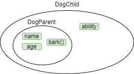
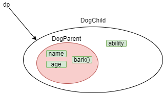
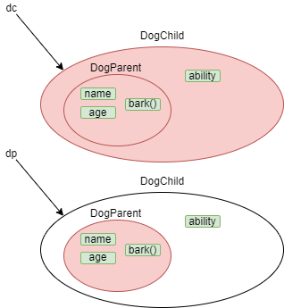

# 1. 다형성 (polymorphism) 🚀

<br>
<br>

## 1-1. 다형성 이란 ?

<br>

객체지향 개념에서 다형성은

***여러 가지 형태를 가질 수 있는 능력***을 의미한다.

Java에서는 한 타입의 참조변수로 여러 타입의 객체를 참조할 수 있도록 **다형성**을 프로그램적으로 구현했다.

한 타입의 참조변수로 여러 타입의 객체를 참조한다고 ??

***조상타입의 참조변수로 자손클래스의 인스턴스를 참조할 수 있다는 것***이다.

밑에 예제를 보자.

```java
class DogParent {
    String name;
    int age;

    void bark() {
        System.out.println("멍멍 !!");
    }
}

class DogChild extends DogParent {
    String ability;
}
```

밑에는 위 예제에서 `DogParent클래스와 DogChild클래스의 관계를 그려보았다.



우리는 이 두 클래스의 인스턴스를 생성하라고 하면 다음과 같이 할 것이다.

```java
DogParent dp = new DogParent();

DogChild dc = new DogChild();
```

위에 두 참조변수 `dp`, `dc`는 인스턴스의 타입과 일치하는 타입의 참조변수이다.

하지만 서로 상속관계로 있는 경우, 조상클래스 타입의 참조변수가 자손클래스 타입의 인스턴스를 참조하는 것도 가능하다.

위에서 한말과 같은데 아래 예제를 보면 이해할 수 있다.

```java
DogParent dp = new DogChild();
```
이런 식으로 조상클래스 타입의 참조변수가 자손클래스 타입의 인스턴스를 참조할 때는 보통과 차이점이 있다.

바로 생성된 DogChild 인스턴스의 멤버 중에서 DogParent에 정의되지 않은 멤버는 사용할 수 없다.

아래 그림을 보면 참조변수`dp`는 DogChild클래스의 인스턴스를 가리키지만 빨간색 원 안의 멤버만 사용할 수 있다는 것을 알 수 있다.



<br>
<br>

아래 코드를 보자.

```java
DogChild dc = new DogChild();
DogParent dp = new DogChild();
```

참조변수 `dc`, `dp`는 둘 다 같은 DogChild클래스의 인스턴스를 가리킨다.

하지만 둘의 차이점은 사용할 수 있는 멤버의 개수가 다르다는 것이다.

이 `dc`, `dp`의 차이도 아래 그림으로 나타내었다.



<br>
<br>

*그렇다면 자식타입의 참조 변수가 부모클래스의 인스턴스를 참조할 수 있을까?*

정답은 **컴파일에러** !!

참조변수가 사용할 수 있는 멤버의 개수는 인스턴스의 멤버 개수보다 같거나 적어야하는 것을 잊지말자 !

<br>
<br>
<br>

## 1-2 참조변수의 형변환

<br>

참조변수도 형변환이 가능하다.

단, 서로 상속관계에 있는 클래스 사이에서만 가능하다.

즉, 

1. ***자손타입 -> 조상타입(Up-casting)   : 형변환 생략가능***
2. ***자손타입 <- 조상타입(Down-casting) : 형변환 생략 불가***

<br>

왜 자손타입은 형변환 생략이 가능할까?

위에 1-1에서 언급했던게 기억이 난다면 바로 알 수 있을 것이다.

자손타입은 조상타입보다 멤버의 개수가 많거나 같다.

때문에 `자손타입 -> 조상타입`으로 자동으로 형변환을 해줘도 문제가 되지 않는다.

멤버의 개수가 문제가 되지않기 때문이다 !

하지만 `자손타입 <- 조상타입`은 문제가 될 수 있기 때문에 명시적 형변환을 해줘야 한다.

위에서 썻던 예제를 다시 가져오겠다.

```java
DogParent dp = new DogChild();
```
바로 이 예제인데

사실 이 예제는 `자손타입 -> 조상타입`으로 자동으로 형변환이 된 것이다.

이것을 명시적 형변환으로 바꿔준다면 아래와 같아진다.

```java
DogParent dp = (DogParent) new DogChild();
```