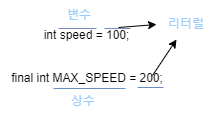

먼저 값(data)를 다루는 법을 알아보자.

항상 `int a = 0;` 이런 식으로 초기화하고 사용할 줄만 알지

선언, 초기화, 변수 타입, 변수 이름을 정확히 설명할 수 없었다.

이에 대해서 먼저 알아보도록 하자.


<br><br><br>

# 변수란 ? 🚀

**"변수란, 단 하나의 값을 저장할 수 있는 메모리 공간"** 을 의미한다.

<br><br><br>

> 그럼 이 변수를 어떻게 메모리 공간에 저장할까?
>
> 바로 밑에서 선언과 초기화에 대해 알아보도록 하자.
## 변수의 선언과 초기화 🎈

- **변수 타입** : 변수에 저장될 값이 어떤 '타입(type)'인지 지정; `int`

- **변수 이름** : 말 그대로 이름이다.; `age`

- **변수 선언** : 변수의 이름을 지정; `int age`

    변수 선언 예시

    ```java
    int age; // age라는 이름의 변수를 선언
    ``` 

변수를 선언한 이후부터 변수를 사용할 수 있다.

그러나 그 전에 반드시 변수를 `초기화`해야 한다.

왜 초기화 해야 할까?

위에서 말했 듯이 변수란 **단 하나의 값을 저장할 수 있는 메모리 공간** 을 의미한다.

이때 메모리 공간을 여러 프로그램이 공유하는 자원인데 **전에 다른 프로그램에 의해 저장된 쓰레기 값이 남아있을 수 있기 때문에 우리는 `초기화`해야한다.**

* **변수의 초기화** : 변수를 사용하기 전에 처음으로 값을 저장하는 것

    ```java
    int age = 20; // 변수 age를 선언하고 20으로 초기화한다.
    ```

<br><br><br>

## 식별자(identifier) 란? 🎈

'변수 이름'처럼 프로그래밍에서 사용하는 모든 이름을 `식별자`라고 한다.

우리는 코딩 컨벤션(coding convention)이라고 해서 미리 식별자를 작성하는데에 규칙을 정해두고 코딩한다.

<br><br><br> 

## 변수의 타입 🎈

우리는 값(data)을 많은 종류(type)으로 나눌 수 있다.

크게는 `문자`와 `숫자`로 나눌 수 있다.

숫자는 `정수`와 `실수`로 나눠진다.

이러한 값(data)와 종류(type)에 따라 저장될 공간의 크기와 저장형식을 정의한 것을 ***`자료형(data type)`*** 이라고 한다.

자료형(data type)은 크게 `기본형`과 `참조형`으로 나눠진다.

기본형은 무엇이고 참조형은 뭘까??

간단하게 소개하면 기본형은 실제 값(data)를 저장하고 참조형은 주소를 저장한다.

<br><br>

### 기본형 (primitive type)

정말 값(data) 자체를 저장하는 것으로 **8개의 자료형**이 존재한다.

- 논리형 (boolean) [1byte]

    ```java
    boolean isOk = true;
    ```

- 문자형 (char) [2byte]

    ```java
    char = 'c';
    ```

    `char` 같은 경우는 문자를 내부적으로 (Unicode)로 저장한다.

    변수에 '문자'가 저장되는 것 같지만, 사실은 문자가 아닌 '문자의 유니코드(`정수`)'가 저장된다는 말이다.

    유니코드(Unicode)로 저장한다는 의미는 결국 정수형, 실수형과 연산이 가능하다는 것이다. 

    char이 2byte를 사용하는 이유도 유니코드이기 때문이다.

    이런 유니코드를 사용해보는 예제를 보면 더 이해하기 쉽다.

    문자 'A'는 유니코드 '65'와 같다는 것을 보여주는 예제이다.

    문자 타입을 int타입으로 변환하여 저장하면 65가 된다.
    
    ```java
    char ch = 'A';
    int code = (int) ch;
    ```

- 정수형 (byte, short, int, long) [1byte, 2byte, 4byte, 8byte]

    ```java
    long userId = 1L;
    ```

- 실수형 (float, double) [4byte, 8byte]

    ```java
    double pi = 3.14;
    ```

<br><br>

### 참조형 (reference type)

**참조 변수**라고 어디서 많이 들어봤는데.. 참조하는 변수를 가르키는건가?

```java
클래스이름 변수이름; // 변수 타입이 기본형이 아닌 것들은 모두 참조 변수이다.
```

참조 변수 선언 및 초기화 예시

`Dog 클래스 타입`의 `참조변수 myDog`를 선언한다.

참소변수는 `객체의 주소 값`을 갖는다.

위에 변수 초기화 예시 였던 `int age = 20;`과 같이 참조변수 myDog를 객체의 주소값을 초기화 시킨 것이다.

```java
Dog myDog = new Dog("복팔치");
```

<br><br><br>

## 상수와 리터럴(constant & literal) 🎈

<br>

### final, 상수 란? 

상수를 선언하기 위해서 필요한 키워드이다.

변수의 타입 앞에 키워드 `final`을 붙여주기만 하면 상수가 선언된다.

상수를 선언할 때 주의점이 있는데

이는

1. 상수는 선언과 동시에 초기화해야 한다.
 
    에러 발생 예제    
    ```java
    final int MAX_SPEED // 에러 발생 !!
    ```

2. 한 번 초기화된 상수의 값은 변경할 수 없다.

    에러 발생 예제
    ```java
    final int MAX_SPEED = 100;
    max_speed = 300;
    ```

3. `OK !!` 상수는 반드시 선언과 동시에 초기화해야 한다.

    성공 예제
    ```java
    final int MAX_SPEED = 100;
    ```
<br><br>


### 상수... 리터럴 어디서 들어봤는데??

**상수 (constant)** : 값을 한번만 저장할 수 있는 공간을 말한다.

**리터럴 (literal)** : 그 자체로 값을 의미하는 것 

단지 상수 대신에 리터럴이라는 용어를 사용한다.

상수의 다른 이름이다.

</img>

<br><br><br>

## 형변환 (캐스팅, casting) 이란? 🎈

`Hello(문자열) + 12(정수형)` 타입이 다른데 어떻게 연산할까?

서로 다른 타입간의 연산을 하기위해서는 타입을 하나로 일치시켜 줘야 한다.

**형변환 : 변수 또는 상수의 타입을 다른 타입으로 변환하는 것**

그러면 우리는 형변환을 어떻게 할 수 있을까 ??

밑에서 바로 알아보도록 하자.

<br>

### 형 변환하는 방법

> ***(타입)피연산자***

형변환하고자 하는 변수나 리터럴의 앞에 변환하고자 하는 타입을 괄호와 함께 붙여주기만 하면 형변환이 된다.

이때 `괄호()`는 `캐스트 연산자` 또는 `형변환 연산자`라고 한다.

다음 예시 코드를 보면서 이해하도록 하자

```java
// double 타입의 변수 averageScore를 int 타입으로 형변환

double socreDouble = 85.4;
int scoreInt = (int) d; 
```

이런 식으로 사용하게 된다.

여기서 주의해야 할 점은 `double`은 실수형으로 소수점이 존재하는데 형변환을 `int`인 정수형으로 한다면 소수점은 제거 되어버린다.

밑에서 어떻게 없어지는지 과정을 써보았다.

```java
int scoreInt = (int) d;
int scoreInt = (int) 85.4;
int scoreInt = 85;
```

이런 식으로 소수점이 사라지는 것에 주의해야 한다.

또 주의해야 할 점은 기본형(primitive type)에서 boolean을 제외한 나머지 타입들은 서로 형변환이 가능하다는 점이다.

<br><br><br>

## 자동 형변환 🎈

우리는 편의상 형변환을 생략할 수 있는데

이 일은 '컴파일러'가 생략된 형변환을 자동적으로 추가해주는 것이다.

코드를 보면서 어떤 예시가 있는지 먼저 봐보자

```java
float f = 1234; // 형변환의 생략이다. 실제로 우리는 float f = (float) 1234; 형변환과 함께 변수를 초기화 해줘야 한다.
```

근데 만약 변수가 저장할 수 있는 범위를 넘을 때는 어떻게 될까?

바로 `incompatible types`에러가 발생한다.

큰 타입에서 작은 타입으로 형변환하면 값 손실이 발생할 수 있다는 뜻이다.

예를 보면

```java
byte b = 1000; // byte의 범위 : (-128 ~ 127)
```

이  있다.


우리는 이런 자동적으로 발생하는 형변환을 `산술 변환`이라고도 한다.

근데 형변환은 무슨 규칙이 있을까?

컴파일러가 자동 형변환을 해줄 때 어떤 규칙을 통해서 진행할까?

자동 형변환의 규칙 이라는 것이 있는데 이것에 대해서도 잠시 알아보자

<br><br><br>

### 자동 형변환의 규칙

> ***기존의 값을 최대한 보존할 수 있는 타입으로 자동 형변환***

큰 타입에서 작은 타입으로 형변환하면 값 손실이 발생할 수 있으므로 에러가 뜬다.

당연히 작은 타입에서 큰 타입으로 변환하면 값 손실이 발생하지 않는다.

때문에 컴파일러는 표현 범위가 좁은 타입에서 넓은 타입으로 자동 형변환 해준다.