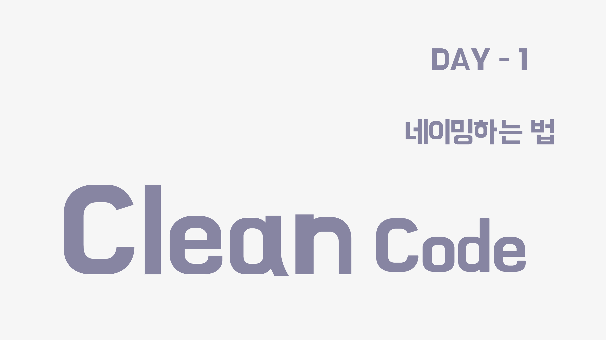

### 목차


- [1. 개요](#클린-코드란?)

- [2. 클린 코드란](#클린-코드란?)

- [3. 클린 코드 첫걸음으로 !! 😏](#클린-코드-첫걸음으로-!!-😏)
  
  - [1. 의미 있는 이름을 짓자.](#1.-의미-있는-이름을-짓자.)

  - [2. 루프 속 i, j, k 사용하지 않기](#2.-루프-속-i,-j,-k-사용하지-않기)

  - [3. 통일성 있는 단어 사용하기](#3.-통일성-있는-단어-사용하기)

  - [4. 변수명에 타입 넣지 않기](#4.-변수명에-타입-넣지-않기)

  - [5. 패키지 네이밍 가이드](#5.-패키지-네이밍-가이드)

  - [6. 클래스 네이밍 가이드](#6.-클래스-네이밍-가이드)

  - [7. 메소드 네이밍 가이드](#7.-메소드-네이밍-가이드)

---

# 개요
이번에 인턴을 하는데 프로젝트를 진행하면서 비즈니스 로직 작성 중 내 코드가 울고있었다.

클린코드를 통해 보다 좋은 코드를 내 손으로 짜고싶어졌기에 이렇게 시작해본다.

---

# 클린 코드란?


> **성능**이 좋은 코드
의미가 **명확한** 코드
**중복**이 제거된 코드

누구나도 아는 그런 내용이다.
그렇지만 빨리 기능을 개발해야 한다는 촉박함에 나의 스파게티 코드가 완성되어졌었다.

---

## 클린 코드 첫걸음으로 !! 😏
클린코드의 시작으로 먼저 네이밍에 대해서 고민해보는 시간을 가져봤다.


### 1. 의미 있는 이름을 짓자.

아니 의미 있는 이름이 뭔데?

#### 💁‍♂️ 변수명만 해도 바로 알 수 있다.

``` java
  int bookCount;
  String bookTitle;


  int a;
  String b;
```

`a`, `b` 내가 왜 만들었더라..?

`a`, `b`라는 변수명을 보고 어떤 역할인지 알 수 없다.
변수 초기화 된 후에 사용이 어떻게 되어지는지 흐름을 보고나서야 혹은 결과가 나오고나서야 알 수 있을 것이다.

**그러나 변수명을 바꾼다면?**

- `bookCount`, `bookTitle`
  변수명을 보자마자 책 수량, 책 제목을 의미함을 알 수 있다.

**또 다른 방법으로는**

- 변수명 `selectedBook`
  유저의 `request`에 의해서 선택된 `Book`임을 의미한다.
  선택된 책임을 분명하게 나타내어 줄 수 있었다.

- 클래스 사용
  거기에 덧붙여서 클래스를 사용해서
  `selectedBook.getName()`이나
  `selectedBook.getCount()`으로 의미를 명확하게 해주었다.
``` java
  class SalesBook {
      bookCode code;
      String name;
      int count;
  }

  SalesBook selectedBook = salesBookRepository.getBookByCode(puchaseRequest.getBookCode());

  System.out.print("User Purchased %s. count = %d",
                  selectedBook.getName(), selectedBook.getCount());				

```

---

### 2. 루프 속 i, j, k 사용하지 않기

항상 i, j, k를 for문에서 자주 사용해왔었는데 Java 8 이상이 되면서 생각보다 코드에 i, j, k가 들어갈 일이 적어졌다.
**💁‍♂️ i, j, k 대신에 밑에 방법들을 사용해보자 !**

- **advanced for문**으로 대체하자
```java
    for (int i = 0; i < messages.size(); i++ ) {
    	// ..
    }
  
  를
  
	for (String message : messages) {
    	// ..
    }
  
  로 바꿔써준다.
```
- **lamda**를 사용하자
```java
    for (String message : messages) {
    	// ..
    }
    
    를
    
    messages.stream().forEach(
    	message -> // ..
    }
    
    로 바꿔써준다.

```
- i, j, k 대신 다른 변수명을 이용해보자 !
```java
    for (int row = 0; row < 100; row++) {
    	// ..
    }
```

---

### 3. 통일성 있는 단어 사용하기

나는 Member라 쓰고 너는 User라고 쓰네..
이런 경우에는 팀원들과 단어 약속을 하는게 좋다.

- Member / Customer / User
    - 팀이랑 상의해서 공통 변수명을 결정

---

### 4. 변수명에 타입 넣지 않기

이미 알고 있는데 굳이 또 넣어주지 말자.

- 타입으로 알 수 있으면 타입을 변수명에 포함시키지 않는다.
- List는 변수명 뒤에 `s` 혹은 `List`를 붙인다.
- Map은 타입을 나타내기 위해 변수명 마지막에 포함시켜준다.

```java
    String nameString	(😡) -> name 	  (😆)
    int itemPriceAmount	(😡) -> itemPrice (😆)
    
    Account[] accountArray	  (😡) -> accounts (😆)
    List<Account> accountList (😆) -> accounts (😆), accountList (😆)
    Map<Account> accountMap   (😆)
    
    public interface IShapeFactory (😡) -> ShapeFactory   (😆)
    public class ShapeFacotoryImpl (세모) -> CircleFactory (😆)
```

---


### 5. 패키지 네이밍 가이드

- 패키지 명은 오직 소문자만 사용하자

```java
    com.example.minishop  (😆)
    com.example.miniShop  (😡)
    com.example.mini_shop (😡)
```

---

### 6. 클래스 네이밍 가이드

- 대문자로 시작

```java
    // 클래스는 명사, 명사구
    Character, ImmutableList
    
    // 인터페이스는 명사, 명사구, (형용사)
    List, Readable
    
    // 테스트 클래스는 Test로 끝나기
    HashTest, HashIntegrationTest
```

---

### 7. 메소드 네이밍 가이드

- 소문자로 시작

```java
    // 메소드는 동사, 동사구
    sendMessage, stop
    
    // jUint 테스트에 underscore 사용되기도 한다.
    // <methodUnderTest>_<state> 패턴
    pop_emptyStack
```